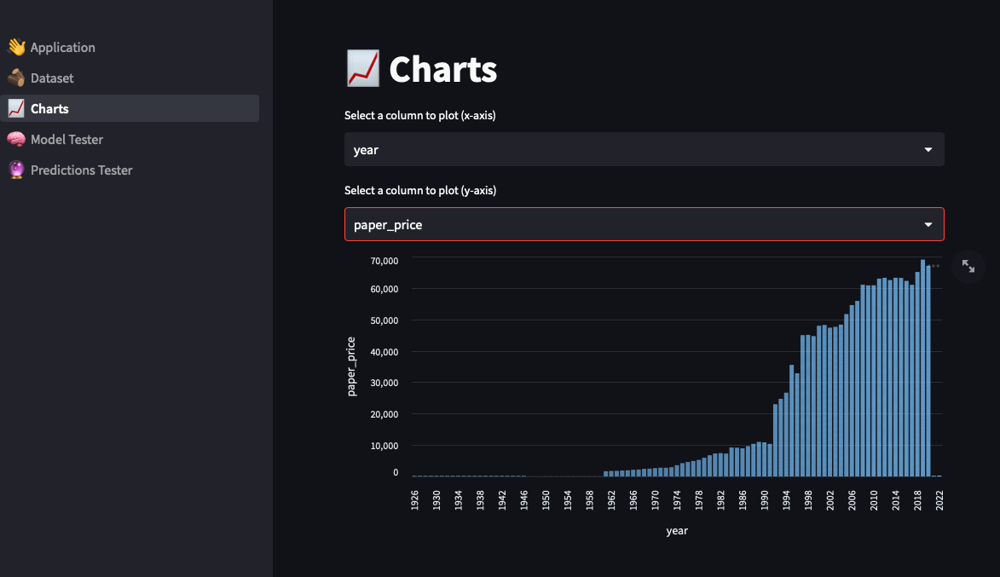

# Paper Shortage Analysis Repository

This repository contains data, code and applications related to the analysis of paper shortage situation in the year 2022. The data includes wood and paper import, export and freight data from the UN as well as forest related and COVID-19 data from other sources. The analysis includes visualization, modeling and prediction of paper, wood prices based on the available data.

You can see a running instance [here](https://paper-shortage-eda-fabio1623.streamlit.app).

Please note that it is deployed on **Streamlit Cloud** so the application could go in **sleep mode** and need some time to reload.

## Analysis Data

The data used in this analysis comes from various sources including the United Nations and other public sources. The following datasets have been used in this analysis:

 - Wood and paper import, export and freight data from the United Nations (UN)
 - Forest related data from public sources
 - COVID-19 data from public sources

Analysis Data are stored in following folders, under jupiter_data/:

- covid/
- e-commerce/
- forest/
- wood-pulp-business

## Code

The code in this repository is written in Python and includes data cleaning, exploratory data analysis, model building and prediction.
EAD is contained in jupiter_data folder, grouped in different folder per theme.

## Output Data

Cleaned data as well as generated models are found in jupiter_data/data/ folder. 

## Applications

This repository includes two applications for visualizing and predicting paper prices:

Streamlit App: This application allows users to visualize the data through various plots and charts and generate models. The app can be run using the streamlit run _Hello.py command from streamlit-v2 folder.
Tableau Presentation: This presentation contains various visualizations and dashboards to explore the data. The presentation is available at the following link [link].

## Usage

To run the code in this repository, follow these steps:

- Clone the repository: `git clone https://github.com/fabio1623/final-project.git`
- Install the required dependencies.

## Run Streamlit application

- `streamlit run 👋_Application.py`

## License

This project is licensed under the MIT License.
